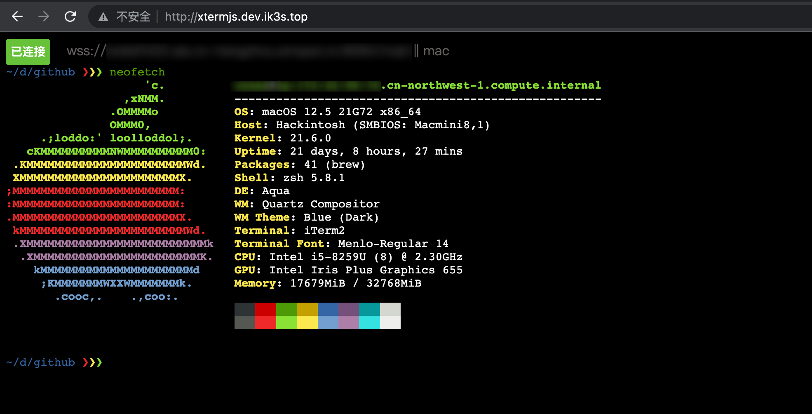
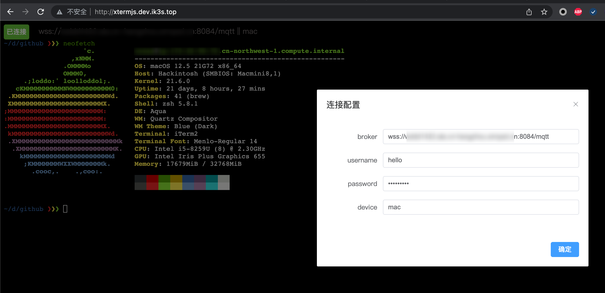

#

golang + mqtt + xterm.js 实现的web 终端
> 用于没有公网方便 ssh 连接

前端mqttjs --> mqtt服务 <--后端golang

目前使用 [https://cloud.emqx.com/](https://cloud.emqx.com/)提供的mqtt 速度还可以




### 使用
```shell
go run main.go -broker=wss://xxx:8084/mqtt -username=xx -password=xx -name=mac -command zsh
```
`broker` mqtt地址, 使用 [https://cloud.emqx.com/](https://cloud.emqx.com/)时 wss的是 :8084/mqtt

`username` 用户名

`password` 密码

`name` 设备名

`command` web终端使用的**shell**

### 前端 [mqtt_shell_web](https://github.com/llych/mqtt_shell_web)
> 原想做多tag的(待以后实现)，使用的vue3 + element plus

也可以使用我编译好的
[web](http://xtermjs.dev.ik3s.top)

### 参考
* https://github.com/lewangdev/MQTT-Web-Terminal
* https://github.com/freman/goterm/blob/master/main.go
* https://www.emqx.com/zh/blog/how-to-use-mqtt-in-golang
